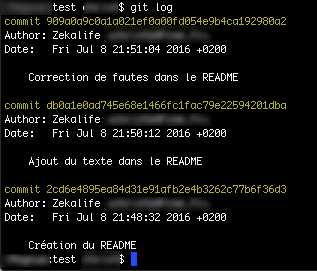

#
 Présentation de GIT

## GIT 

GIT est un logiciel de gestion de version basé sur le modèle distribué. Développé par Linus Torvalds, l'auteur de Linux, il est l'un des plus utilisé actuellement et connais un succès grandissant. Le code peut être partagé directement entre deux développeur mais peut également être installé sur le site [GITHUB](http://github.com). Ce site héberge plusieurs millions de projet opensource pour la plupart. Il est toutefois possible d'ouvrir un compte payant pour y créer des dépôts (repository en anglais) privés.

Rentrons maintenant dans le fonctionnement de GIT

### Commit
Au fur et à mesure de la rédaction du code et la création des fichiers, il est nécessaire de créer des points étapes. Ces points étapes permettent ensuite de naviguer dans les versions pour revenir à l'état du projet à un instant précis. Les points étapes sont appelés *commit*. 

#### Fonctionnement
Après une série de modifications (ajout, suppression ou modification de fichiers) dans un répertoire, il est nécessaire de les enregistrer dans l'index. Pour cela, il faut réaliser les étapes suivante : 

- Si ce n'est pas déjà fait, créer l'index de GIT pour le répertoire en question : `git init`
- Ajouter le ou les fichiers modifiés à l'index de GIT : `git add nom_du_fichier`
- Ajouter le commit en lui-même avec son commentaire : `git commit -m "mon commentaire"`

Lorsque tous les fichiers modifiés ont préalablement été ajoutés à l'index, il est possible de ne pas taper la commande `git add` mais directement la commande `git commit` en y ajoutant l'option `-a`. Par exemple :
	
	git commit -am "mon commentaire"
	
Le commentaire permettra aux autres contributeurs au projet ou à l'auteur plus tard de retrouver facilement certaines étapes du projet comme l'ajout d'une fonctionnalité. Il est donc important que le commentaire soit le plus précis possible. Il ne faut toutefois pas qu'il soit trop long au risque de perdre la personne faisant les recherches dans les descriptions.

### Consulter l'historique
Lorsque le projet progresse, les _commit_ s'accumulent. La consultation de l'historique des *commit* se fait avec la commande :

	git log

La commande affiche la liste des *commit* de la branche sur laquelle nous sommes (nous verrons les branches au chapitre suivant). Pour chaque *commit*, les informations suivantes s'affichent :

- le mot *commit* suivi d'un code complexe. Celui-ci est appelé le *SHA* et est un identifiant unique du *commit*.
- l'auteur du *commit* avec son nom suivi de de son adresse email.
- Le commentaire du *commit*.

Il est possible à tout moment de restaurer les fichiers tels qu'ils étaient lors d'un *commit* en particulier. Pour cela, il faut utiliser la commande : 

	git checkout sha_du_commit
	
le *sha\_du\_commit* est le code s'affichant après le mot *commit* dans l'historique. Cette commande restaure tous les fichiers du projet dans l'état dans lequel ils étaient au moment de ce *commit*.

Il est ainsi possible de consulter chacun des fichiers pour voir les modifications apportées ou de récupérer un extrait de texte qui aurait été supprimé entre temps. 

Pour revenir à l'état final du projet, il faut utiliser la commande :

	git checkout master
	
Celle-ci replace les fichiers dans l'état où ils étaient lors du dernier *commit*.

### Les branches
Il peut être intéressant, par exemple dans le cadre d'un projet de développement de logiciel, de créer une série de version de fichiers en parallèle du développement principal. Par exemple, pour créer une nouvelle fonctionnalité alors que les corrections de bug de la version actuelle sont effectuées dans les fichiers principaux. Cela s'appelle une branche. 

Une branche permet donc d'avoir une série de fichiers qui évoluent indépendamment des autres voire même des fichiers dont le contenu est modifié de deux façon distinctes. Évidemment, Git fourni des outils permettant de fusionner deux branches en une seule avec la possibilité de comparaison le contenu des fichiers ayant été modifier des deux coté.  
